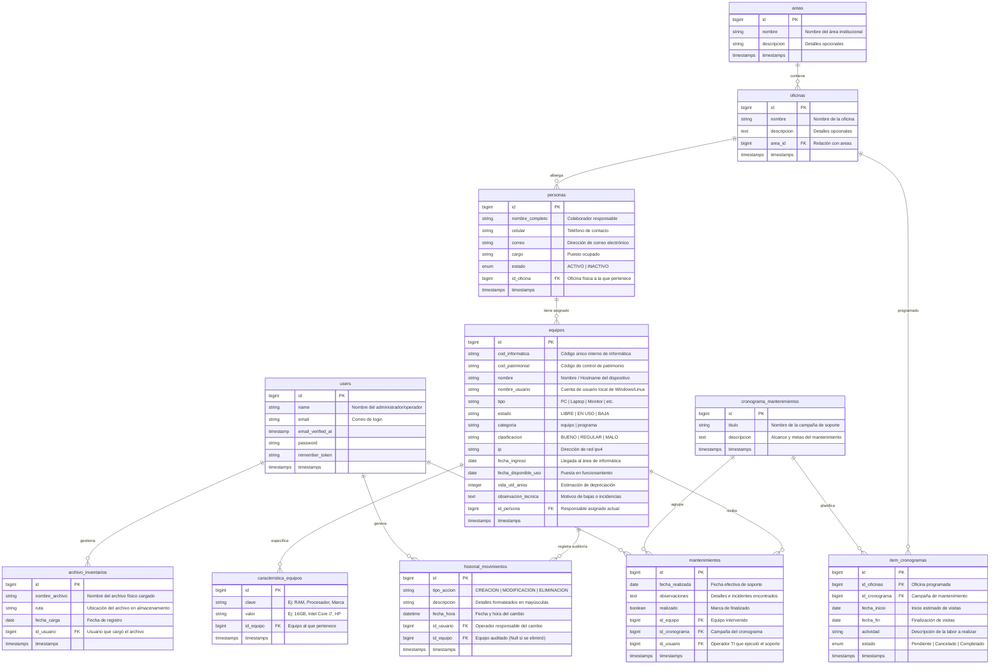

# Diagrama de Base de Datos - Sistema InventarioUGEL

Este artefacto contiene el **Diagrama de Entidad-Relación (ERD)** de la base de datos de negocio del sistema **InventarioUGEL**. Se han omitido de forma intencional las tablas de infraestructura y por defecto de Laravel (como `cache`, `jobs`, `failed_jobs`, `sessions`, `password_reset_tokens` y `personal_access_tokens`) para focalizarse al 100% en las entidades de dominio y sus relaciones.

---

## 1. Diagrama de Entidad-Relación (ERD)

A continuación se muestra el modelo físico representado en un diagrama de Mermaid:

---

## 2. Descripción de Relaciones Clave de Negocio

1. **Jerarquía Estructural (`areas` ➔ `oficinas` ➔ `personas`)**:
   * Un **Área** (ej: *Administración*) contiene múltiples **Oficinas** (ej: *Abastecimiento*).
   * Cada **Oficina** alberga a varios colaboradores (**Personas**).
2. **Asignación de Activos (`personas` ➔ `equipos`)**:
   * Una **Persona** puede tener asignados uno o más **Equipos** o licencias de software (donde `estado` pasa a ser `EN USO`). Si un equipo no tiene asignado ningún responsable, su `id_persona` es `NULL` (estado `LIBRE`).
3. **Detalles Dinámicos (`equipos` ➔ `caracteristica_equipos`)**:
   * Cada **Equipo** posee múltiples filas en la tabla `caracteristica_equipos`, permitiendo agregar metadatos técnicos ilimitados (como *Procesador*, *Memoria RAM*, *Almacenamiento*, *Marca*, *Modelo*) sin requerir alterar la tabla de base de datos principal.
4. **Planificación y Mantenimiento (`cronograma_mantenimientos` ➔ `item_cronogramas` / `mantenimientos`)**:
   * Un **Cronograma de Mantenimiento** planifica visitas por oficina a través de **Item Cronogramas** definiendo rangos de fecha y estados de realización.
   * Al realizarse la intervención técnica sobre un **Equipo**, se registra un evento en **Mantenimientos** detallando la fecha real, el operador de TI responsable (`id_usuario` vinculando a `users`), y observaciones técnicas encontradas.
5. **Auditoría e Historial (`users` / `equipos` ➔ `historial_movimientos`)**:
   * Cada cambio granular o movimiento en un equipo o software (inserción, actualización de características, cambio de responsable, eliminación) queda auditado en el **Historial de Movimientos**, ligando de forma explícita quién realizó la acción (`id_usuario`) y qué equipo fue afectado (`id_equipo`).
